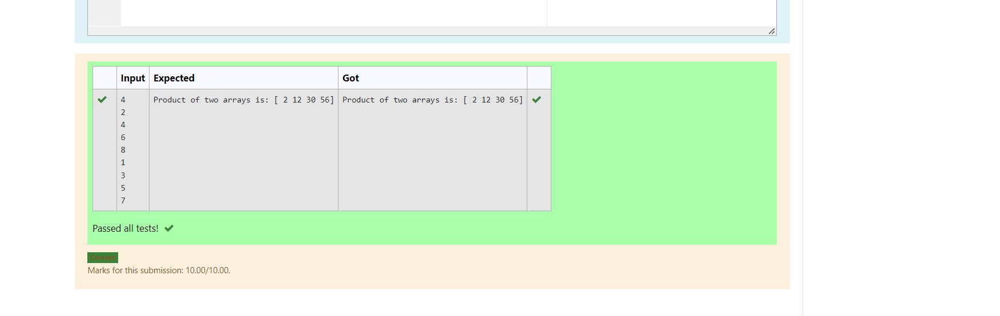

# Multiplying-two-matrix

## Aim:
To write a program to perform Multiplying-two-matrix using python programming.

## ALGORITHM:

### Step 1:
Import Numpy module as np.
### Step 2:
Get input from the user.
### Step 3:
Create empty lists l1 and l2.
### Step 4:
Use for loop to append the values into the list created.
### Step 5:
Print the product of two arrays.

## PROGRAM: 
```python
#Program to perform Multiplying two matrix using python programming.
#Developed by: Siva Chandran R
#RegisterNumber: 22005531
import numpy as np
n=int(input())
l1,l2=[],[]
for i in range(n):
    l1.append(int(input()))
for i in range(n):
    l2.append(int(input()))
arr1=np.array(l1)
arr2=np.array(l2)
product=arr1*arr2
print("Product of two arrays is:",product)
```

## OUTPUT:


## RESULT:
Thus the program is written to perform Multiplying-two-matrix using python programming.
